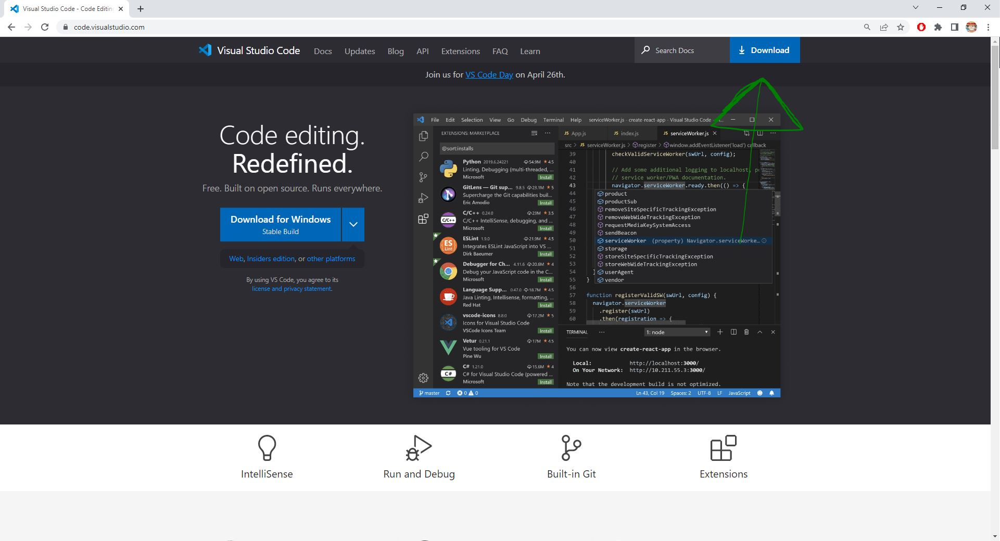
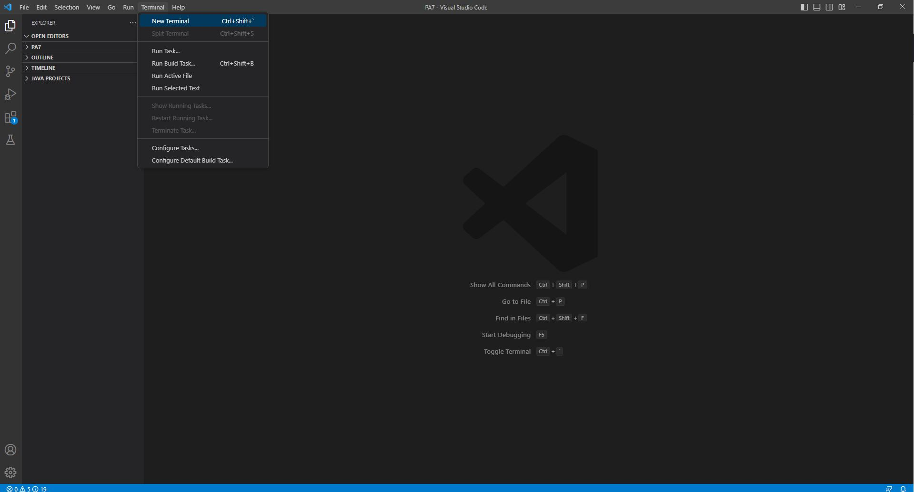
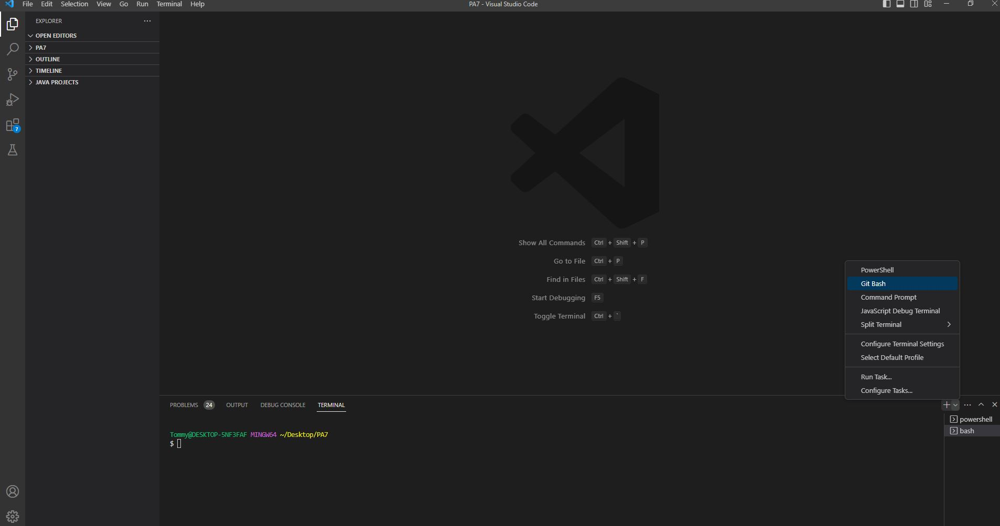
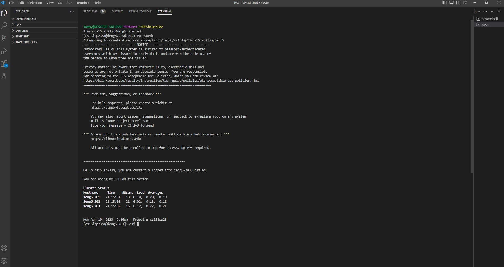
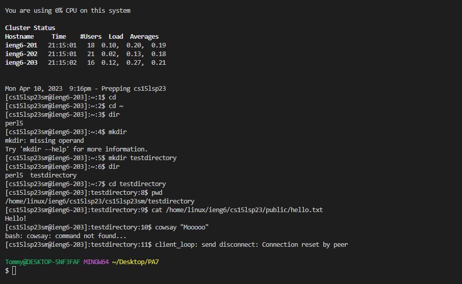

# Connecting to the Remote Desktops at UCSD
***
**Welcome to CSE 15L!** Throughout the quarter in CSE 15L, you will likely want or need to connect to a remote desktop to work on your programming assignments. While this may take a few steps, it is a very simple process!
***
**STEP 1 - Downloading neccesary programs**

Make sure to download the program [Visual Studio Code](https://code.visualstudio.com/) to start the process of connecting your UCSD account to the remote terminal.

When you get to the webpage for Visual Studio Code, press the download button at the top right corner and choose the operating system of the computer you are using. This is what the webpage should look like:

Once you have finished downloading Visual Studio Code, start by opening the application. 

**Important:** If you are using Windows *like me!* you need to also download [Git](https://gitforwindows.org/) before creating a terminal. 

When you are ready to continue, it is time to create a new terminal. You can do this by clicking the "terminal" drop down menu on the top left of the Visual Studio Code application, as shown in the image below:

Once you have opened the terminal, you are only one step away from being ready to remotely access the UCSD desktops. You may have noticed that your terminal should say "powershell". It is important to change this to "bash" before attempting to log in to your UCSD account. The following image depicts where and how you can make this change:

***
**STEP 2 - Logging in to the UCSD remote desktop**

Now, you should be ready to remotely connect to the UCSD computers. 

It is important to note that the log in information you will need to use is **NOT** the same as your UCSD canvas log in. To find your account, you can enter your PID on this website: [https://sdacs.ucsd.edu/~icc/index.php](https://sdacs.ucsd.edu/~icc/index.php) and it will tell you your account information. 
*You may need to reset your passcode in order for your account to work*

Once you know your account credentials, you should mimic the following command as the first thing you enter into the terminal:

$ ssh cs15lsp23sm@ieng6.ucsd.edu

**Note** Firstly, the $ will be on the terminal already and you do NOT need to type it. Second, replace the part of this command that says "cs15lsp23sm" with your associated username, in this example this refers to *my* account. 

If you have ran the command correctly, you will see that the terminal prompts you to enter a passcode. Don't be shocked when nothing is typing into the bar, the log in will still work if you type your password accurately. Once you have succesfully logged in, you should see something similar to the following image on the terminal:

Congratulations! You have successfully logged in to the UCSD remote terminal. The last thing to do now is to run some commands :D

***
**STEP 3 - Running Commands**

When you access the remote terminal, you should experiment with running some commands! If you are unfamiliar with many commands, that is not an issue. I am also very unfamiliar with commands. Here is a picture of me attempting some commands on the terminal:

In the above screenshot, I play around with a lot of commands relating to directories, or what you may know as folders if you are unfamiliar with that term. I used the "mkdir" command to create a directory/folder titled "testdirectory", and then used the "dir" command to list my directories. I finished by changing the directory to the new one I had created using the "cd" command. These commands are important for making directories for each project you decide to work on, so you can organize your code!

As you can also see, I used a long command that started with cat. I don't know what this command does, but it seems like it accessed a file titled "hello.txt" from the remote desktop and printed out it's contents. Even though I am unfamiliar with the command, by testing I am able to basically understand it, and then I can go on to learn its usages and advantages. That is the importance of practicing with commands!

Lastly, I tried the "cowsay" command. It did not work likely because I need to install extra packages, but the command is supposed to print out an ASCII picture of a cow that moos back at you. I found this command by searching for fun commands to use on the internet, and even though it didn't work before my connection was interupted, I have learned the lesson that you may need to install certain things for certain commands you may find to work, so I gained knowledge in the process.

***

**Good job on completing the tutorial for connecting to the UCSD remote terminal!**
