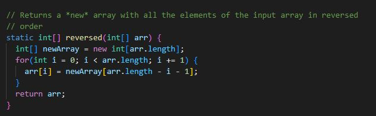
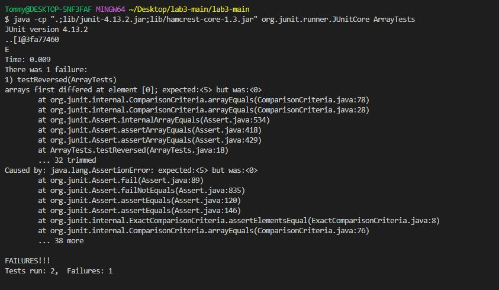
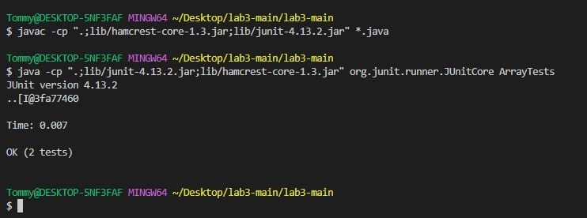

# Lab Report 2 - Servers and Bugs
***
**Part 1 - Setting up a Web Server (StringServer)**

In order to set up StringServer, I started by referencing the code for NumberServer that we worked on during lab 2, and applying edits in order to change the code to the desired effects.

*I made sure to verify that the syllabus allows for this, but if this is somehow still against the rules please let me know in my feedback so I can revisit the task*

My code is as follows:

This code uses the `handleRequest` method in order to update my web server. This method operates based on the parameter `url` which refers to the URL entered in the web browser, and updates the String `str` which carries information about the string that should be displayed on the webserver. 

To call this method, all you have to do is enter the URL to the hosted port that the script from Server.java (from lab 2) will generate and send in the terminal for you to open. Once you are on the webpage, editing the associated url by adding things to the end of it will call the `handleRequest` method. 

Specifically, this method checks for when the user adds `/add-message?s=' and then an associated message to the end of the url. The line of code that does this is line 14, which says `if (url.getPath()contains(s:".add-message")) {`.

If the user did add this sort of structure onto the end of the url, then a string array named `parameters` is generated which contains all parts of the url split by the equals sign, but after the query "?". Therefore, we can expect `parameters` to look something like: [s, chosen message]. Therefore, once we verify that the first thing in the array `parameters` is indeed just "s", meaning the url add on was typed correctly, then we go ahead and add the chosen message to the web page.

In order to add the message, we add a newline to our variable `str` and then add the chosen message from the url. We then finish by returning the String `str` which updates the webpage.

Lastly, if someone were to type a random url, the method would display "404 Not Found!" on the webpage.

Here is the method being called in action, starting from the inital launch of the web page:

**1. Initially launching the web server**

**2. Adding my first message to the web server**

**3. Attempting to add an emoji as a message**

**4. Typing my 2nd message before entering the url**

**5. Sending my 2nd message and seeing the web server update**

Something interesting to not is that when I attempted to send an emoji, the site returned "?" as part of `str`. Likely, the system is converting an unrecognized character to "?". 

Another observation is that `str` starts on line 2 of the website's display instead of line 1. This is because the code calls for a newline before adding to the string. I guess for that reason this behavior is expected, but I also believe it is something that can be fixed.

***

**Part 2 - Bugs and Troubleshooting**

The bug that I chose to talk about is the one found in the `reversed` method found within ArrayExamples.java

The buggy code can be seen below:

In the following code block, I have provided both a failure inducing and a non failure inducing input for the `reversed` method , with an associated Junit test.

`@Test`

  `public void testReversed() {`
  
    int[] input1 = {1,0,0,5};
    
    int[] input2 = {0,0,0,0};
    
   `assertArrayEquals(new int[]{5,0,0,1}, ArrayExamples.reversed(input1));`
   
   `assertArrayEquals(new int[]{0,0,0,0}, ArrayExamples.reversed(input2));`
    
  `}`
  
  After compiling and running my code, this is what I see in the terminal: 
  
  
  
We can see from the failed Junit test that For the array `input1`, it expects `reversed(input1)` to start with a 0, when intuitively we know that it should start with a 5. So, we see that the symptom of the bug caused by the `reversed` method sets at least the first number in the reversed array to 0 when it should and shouldn't be accurate. 
  
Upon further examination of the code, it becomes clear that it is returning the wrong array.

The bugged code in question:

`static int[] reversed(int[] arr) {`

    int[] newArray = new int[arr.length];
    
    for(int i = 0; i < arr.length; i += 1) {
    
     arr[i] = newArray[arr.length - i - 1];
      
    }
    
   `return arr;`
    
  `}`

The code starts by creating an array titled `newArray` with initial length equal to that of the inputted array `arr`. 

Then the code sets all of the data from `arr` to data from `newArray`. However, since `newArray` is an empty array, this is going to set the entire array `arr` to be zeros. At the end of the code when we return `arr`, we should then expect an array full of only zeros. That is why the array {0,0,0,0} (input2) does not fail the Junit test but the array {1,0,0,5) (input1) does.

To fix this code, we simply then just need to switch `newArray` with `arr` within the for loop and return `newArray` instead. Here is the associated fixed code:

`static int[] reversed(int[] arr) {`

    int[] newArray = new int[arr.length];
    
    for(int i = 0; i < arr.length; i += 1) {
    
      newArray[i] = arr[arr.length - i - 1];
      
    }
    
    `return newArray;`
    
  `}`
  
  This is the result of the same Junit tests when running the program with this new code:
  
  
  
  ***
  
 **Part 3 - What I Learned During Labs 2&3**
 
 Funny enough, I unfortunately couldn't make it to Lab 3 so my learning experience is narrowed just a bit to what I learned during Lab 2.
 
 I think Lab 2 taught me many things specifically when it came to running a web server, the first being just launching one in general. I had general knowledge that computers run and host servers but I had no actual idea of how to do that. I remember as a child trying my hardest to run a minecraft server but I had absolutely no idea how to do so and couldnt follow tutorials either. While I am sure the implementation of something like that varies heavily from the web servers we produced in lab 2, I also feel like I gained insight into how servers are hosted more generally. I also got to experience the difference in data storage between server side and client side point of views, and saw that when hosted on a different computer system, each user would be able to see and manipulate a different number for their NumberServer, while when launching the site from the ieng6 remote desktops at UCSD, even though me and my lab partners were on different computers from ieng6 such as computer 202 and 203, we still saw the same number displayed on our NumberServer across our different accounts.
