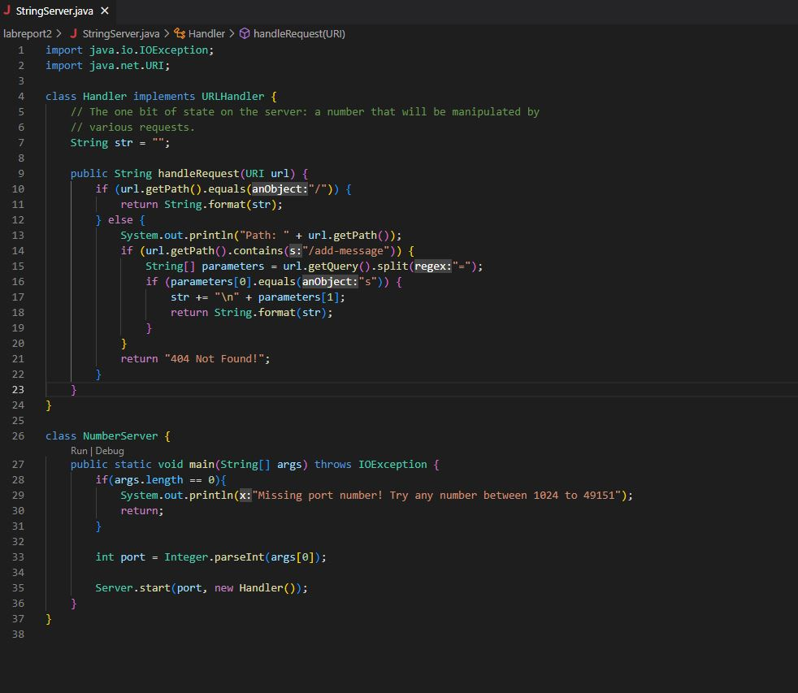
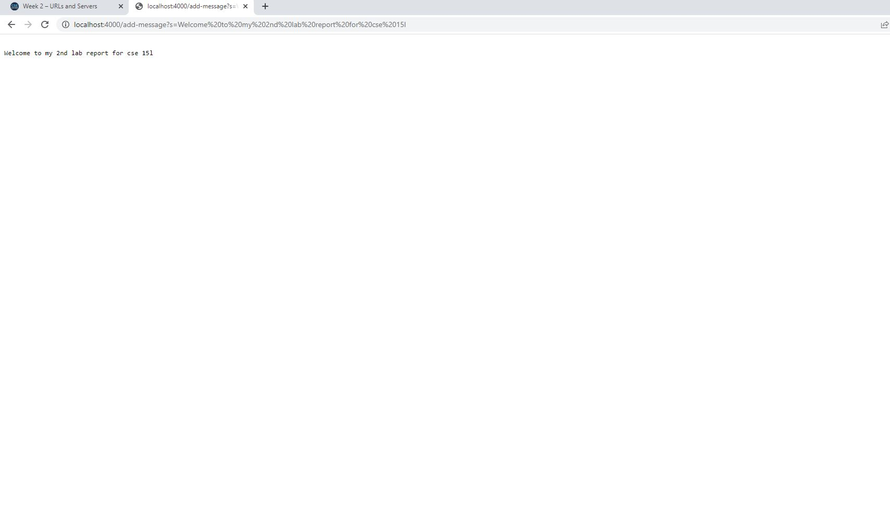
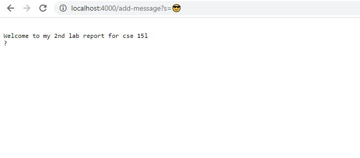

# Lab Report 2 - Servers and Bugs
***
**Part 1 - Setting up a Web Server (StringServer)**

In order to set up StringServer, I started by referencing the code for NumberServer that we worked on during lab 2, and applying edits in order to change the code to the desired effects.

*I made sure to verify that the syllabus allows for this, but if this is somehow still against the rules please let me know in my feedback so I can revisit the task*

My code is as follows:

This code uses the `handleRequest` method in order to update my web server. This method operates based on the parameter `url` which refers to the URL entered in the web browser, and updates the String `str` which carries information about the string that should be displayed on the webserver. 

To call this method, all you have to do is enter the URL to the hosted port that the script from Server.java (from lab 2) will generate and send in the terminal for you to open. Once you are on the webpage, editing the associated url by adding things to the end of it will call the `handleRequest` method. 

Specifically, this method checks for when the user adds `/add-message?s=' and then an associated message to the end of the url. The line of code that does this is line 14, which says `if (url.getPath()contains(s:".add-message")) {`.

If the user did add this sort of structure onto the end of the url, then a string array named `parameters` is generated which contains all parts of the url split by the equals sign, but after the query "?". Therefore, we can expect `parameters` to look something like: [s, chosen message]. Therefore, once we verify that the first thing in the array `parameters` is indeed just "s", meaning the url add on was typed correctly, then we go ahead and add the chosen message to the web page.

In order to add the message, we add a newline to our variable `str` and then add the chosen message from the url. We then finish by returning the String `str` which updates the webpage.

Lastly, if someone were to type a random url, the method would display "404 Not Found!" on the webpage.

Here is the method being called in action, starting from the inital launch of the web page:

**1. Initially launching the web server**

**2. Adding my first message to the web server**

**3. Attempting to add an emoji as a message**

**4. Typing my 2nd message before entering the url**

**5. Sending my 2nd message and seeing the web server update**

Something interesting to not is that when I attempted to send an emoji, the site returned "?" as part of `str`. Likely, the system is converting an unrecognized character to "?". 

Another observation is that `str` starts on line 2 of the website's display instead of line 1. This is because the code calls for a newline before adding to the string. I guess for that reason this behavior is expected, but I also believe it is something that can be fixed.

***

**Part 2**
