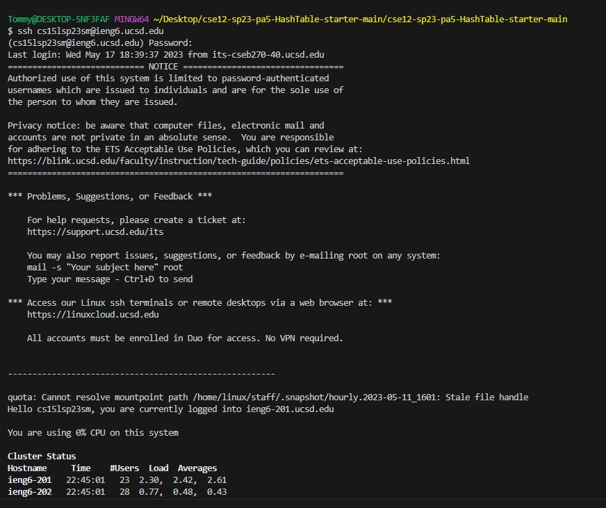
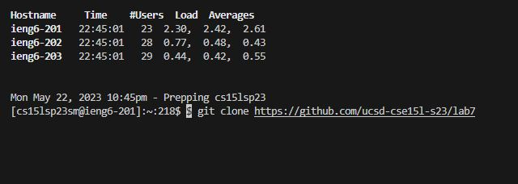
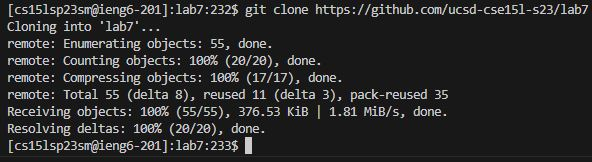
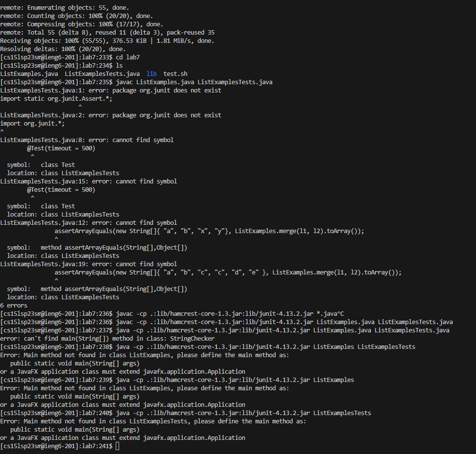
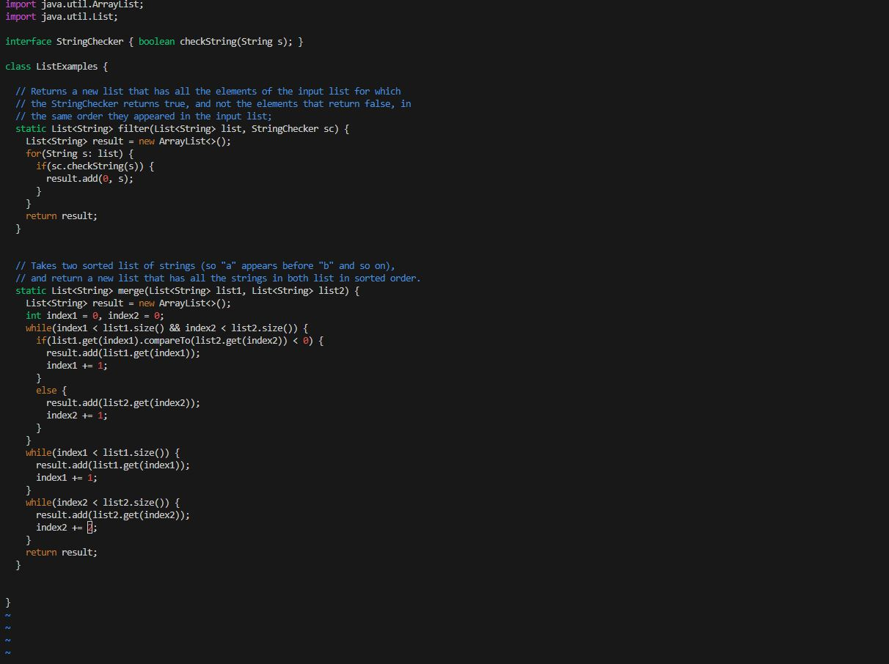
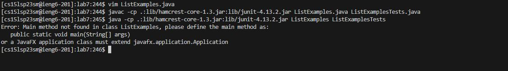
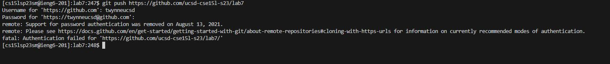

# Lab Report 4 - vim
***
**Step 1 - setting up my environment for vim**

In order to start the lab report, I went to github and deleted my fork of the https://github.com/ucsd-cse15l-s23/lab7 repository, and then proceeded to fork it again.

Now I am ready to continue the tasks!

***

**Step 2 - messing around with commands and vim to speed my coding**

At first, to start the process I need to log into my UCSD remote terminal account. Here is a screenshot of the process:

In order to do this, I enter the command `ssh cs15lsp23sm@ieng6.ucsd.edu` which is my associated UCSD account and the proceed to enter my password.

Now that I have logged in, it is time to clone the repository I had forked before. To do this, I copy the command from the link: https://ucsd-cse15l-s23.github.io/week/week7/#lab-tasks---doing-it-all-from-the-command-line that reads '$ git clone https://github.com/ucsd-cse15l-s23/lab7' and to do this I highlight it with my cursor and then press `<ctrl>` + `c`. Then I go to my visual studio code and paste in the command by pressing `<ctrl>` + `v`.

Now that I have pasted the command, here is what it looks like in the terminal:

As we can see there is an additional `$` than we want so we need to remove it. As opposed to the screenshot, my cursor was at the end of the code line, but I use `<ctrl>` + `a` to move it to the position shown. Then, while still holding `<ctrl>`, I press `d` to delete the problematic `$`. Now I am ready to enter the command so I hit `<enter>`.

This is what is displayed after entering the command:

OK, now that we have that sorted it is time to run the test for "ListExamples.java" to see if there are any erroirs. In order to do this, I start by typing the command `cd lab7` followed by `ls` to make sure I do not make spelling errors when typing further commands. Now I see the "ListExamples.java" file is in my current directory and know I am ready to run it.

As observed in the above screenshot, clearly there is LOTS to talk about. At first I tried to just enter the command `javac ListExamples.java ListExamplesTests.java` to compile the necessary files to be ready for testing. Immediately I am prompted saying that junit is not recognized, which is because I forgot to import the libraries. So, I saw on the lab report docs that I can copy the command from https://ucsd-cse15l-s23.github.io/week/week7/#week7-lab-report that has the libraries written. So, just like above I highlight it with my cursor and then press `<ctrl>` + `c`to copy the command then paste the command by pressing `<ctrl>` + `v`.

However, whenever I do this I have not yet put in the files. I see that the end of the line where the `*` is indicates to write in my files there. So, I press `<left><left><left><left><left>` to get to the proper index, and then hit `<ctrl>` + `<d>` to delete the star. Now, I type in `ListExamples`, before then highlighting the same word, using `<ctrl>` + `c` and `<ctrl>` + `v` once again to copy in the word, then move my cursor to the end of "Examples" and type in `Tests`.

Now I try to compile and it works seemingly. Now I must use the java command which is similar, so I hit `<up>` to get the previous command entered, then I press `<delete><delete><delete><delete><delete>` to delete the ".java" portion of "ListExamplesTests.java", then I press `<ctrl>` + `<left>` to go to the beginning of the word, then I go to the end of "ListExamples.java" by pressing `<left>` and then repeat the process of `<delete><delete><delete><delete><delete>` to remove the ".java" portion.

When I press enter, it seems like the terminal could not find a main method to test so I had an error unfortunately. However, I still know the error within the file itself so I will fix it anyways.

To do this, I enter the command `vim ListExamples.java` and hit `<enter>`

Now that I have entered vim, I type `/1` to enter search mode for "1", then I type `n``n``n``n``n``n``n``n``n``n``n``n``n``n``n``n` (17 times!) which finally brings me to the number that needs to be changed. Now that my cursor is on the proper character, I hit `x` to delete the character, then hit `i` to enter insert mode. From insert mode, I type `2` to place the correct change. Than I hit `<esc>` to exit insert mode. Finally, I stop by typing `:wq` followed by `<enter>` to exit vim.

Now I will try to run the program. Since I had an error locating the main method from before, I know it will not work, but for the sake of the lab report I will mimic the proper steps. 

This is me re trying to compile and run the program:

What I did here was first start by typing `<up><up><up><up><up><up><up><up>` which brought me to my compile command I used previously. Then I hit `<enter>` to recompile the code. Now, I repeated the process, hitting 
`<up><up><up><up><up><up><up><up>` which now brought me to my command to run the code, and hit `<enter>` again. As observed, like expected it did not work :(

Now lastly, I need to push the fix to my github account. I do this in the screenshot below:

 

To do this, I hit `<up><up><up><up><up><up><up><up><up><up><up><up><up><up><up>` (15 times) which brings me to my `git clone` command. I use `<ctrl>` + `a` to travel to the beginning of the line, then while holding `<ctrl>` press `<right><right>` followed by `dw` to delete the word "clone". Then I hit `<space>`, type in `push` and hit `<enter>` to finish. I finish by logging into my github account, where sadly I cannot make the push for some reason.
