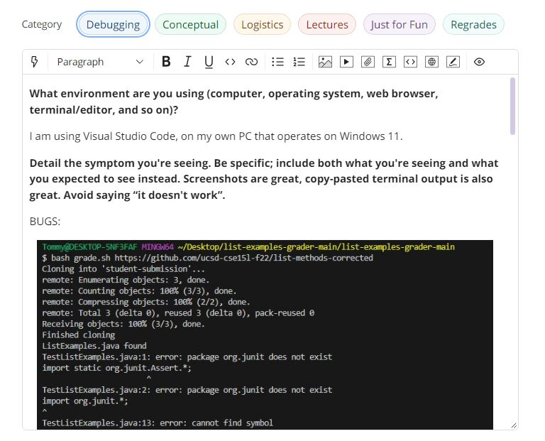
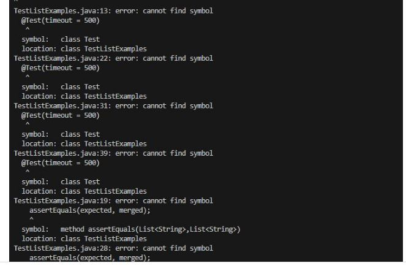
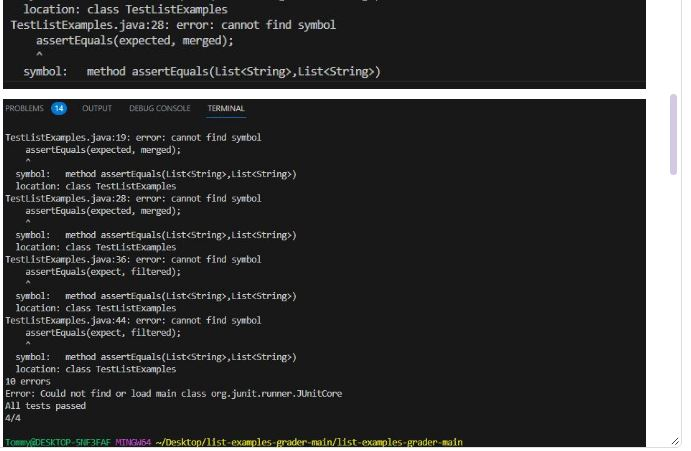
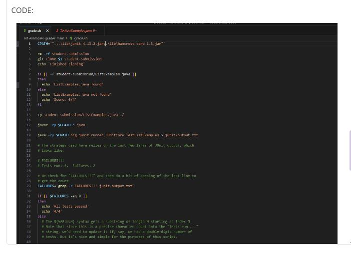
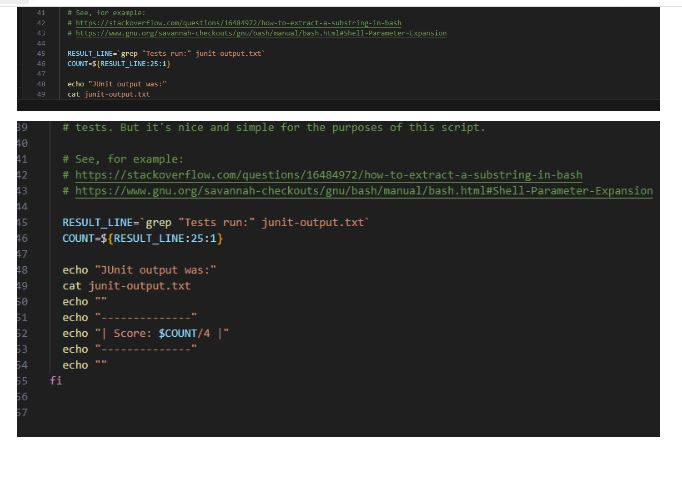
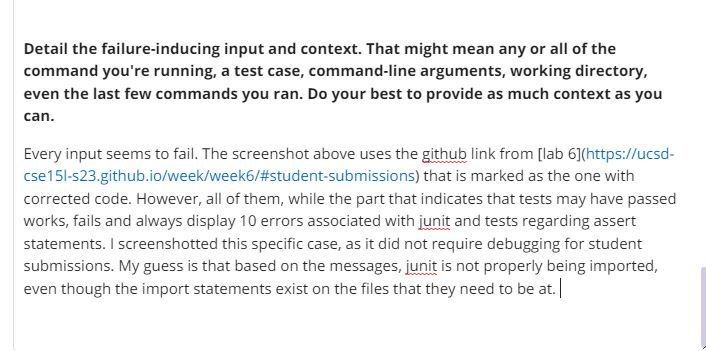
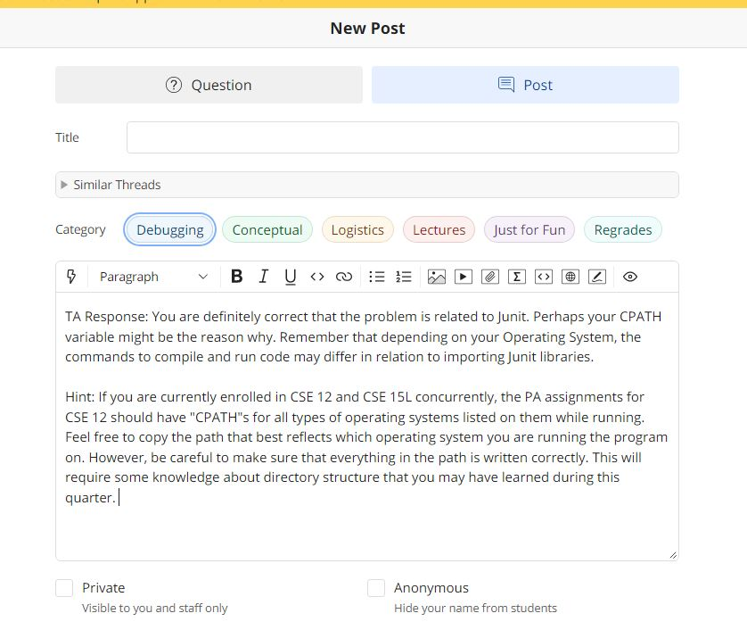

# Lab Report 5 - Putting it all together
***
**Part 1 - Debugging Scenario - student post on EdStem**

For the Debugging scenario, I used the `grade.sh` script from [Scenario 2 from lab 9](https://ucsd-cse15l-s23.github.io/week/week9/#scenario-2) that can be downloaded from this [github repository](https://github.com/ucsd-cse15l-f22/list-examples-grader/blob/main/grade.sh).

When running this code on my computer, regardless of if the bash script is working, it always throws 10 errors. Here is my post on edstem mimicking a student asking a TA to resolve an error:

**Part 2 - Debugging Scenario - TA response on EdStem**

If I was a TA, I would first analyze what the error messages on the terminal indicates. Just like the student suggested, it seems like Junit is not compiling and throwing errors for this reason. After looking over the code and the errors, it would become apparent, that the student who is running the code on a Windows system is not using the correct `CPATH`, as the current variable is mean't for unix based systems like mac, and would not work for Windows. Therefore, a leading response might be something like:

**Part 3 - Debugging Scenario - student attempt to fix the problem**

Now as the student, I would try to directly copy a "CPATH" from one of my previous PA's (I am saying this because this is how I attempted to solve this bug in regards to this lab report). 

Going to the most recent PA I completed for CSE 12, knowing that there are file paths for running Junit listed on the page, I find what I am looking for at [the appendix of PA 7](https://github.com/CaoAssignments/cse12-sp23-pa7-Heaps-and-Priority-Queue-starter#appendix)

I then copy and paste `".;..\libs\junit-4.13.2.jar;..\libs\hamcrest-2.2.jar"` to replace the previous `CPATH` within `grade.sh`

