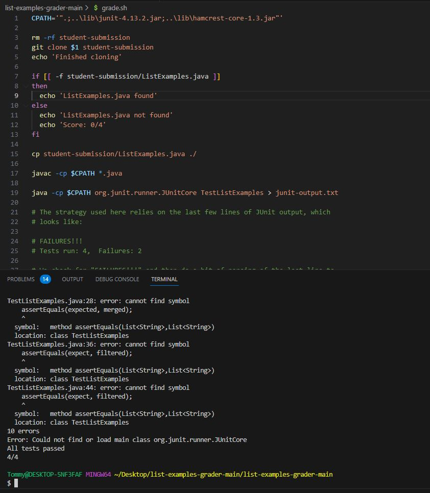

# Lab Report 5 - Putting it all together
***
**Part 1 - Debugging Scenario - student post on EdStem**

For the Debugging scenario, I used the `grade.sh` script from [Scenario 2 from lab 9](https://ucsd-cse15l-s23.github.io/week/week9/#scenario-2) that can be downloaded from this [github repository](https://github.com/ucsd-cse15l-f22/list-examples-grader/blob/main/grade.sh).

When running this code on my computer, regardless of if the bash script is working, it always throws 10 errors. Here is my post on edstem mimicking a student asking a TA to resolve an error:

**Part 2 - Debugging Scenario - TA response on EdStem**

If I was a TA, I would first analyze what the error messages on the terminal indicates. Just like the student suggested, it seems like Junit is not compiling and throwing errors for this reason. After looking over the code and the errors, it would become apparent, that the student who is running the code on a Windows system is not using the correct `CPATH`, as the current variable is mean't for unix based systems like mac, and would not work for Windows. Therefore, a leading response might be something like:

**Part 3 - Debugging Scenario - student attempt to fix the problem**

Now as the student, I would try to directly copy a "CPATH" from one of my previous PA's (I am saying this because this is how I attempted to solve this bug in regards to this lab report). 

Going to the most recent PA I completed for CSE 12, knowing that there are file paths for running Junit listed on the page, I find what I am looking for at [the appendix of PA 7](https://github.com/CaoAssignments/cse12-sp23-pa7-Heaps-and-Priority-Queue-starter#appendix)

I then copy and paste `".;..\libs\junit-4.13.2.jar;..\libs\hamcrest-2.2.jar"` to replace the previous `CPATH` within `grade.sh`

As the student, I then try running the code immediately, and the result is the following:

Clearly the error is not fixed. Then, looking further into the hint my TA gave me, I notice that the `libs` folder is actually `lib` in this case, and that the `hamcrest-2.2.jar` file is different from the `hamcrest-1.3-core.jar` file in my directory, so I try to fix the code by changing those in `CPATH`:

Hmm, it still doesnt seem to work, but maybe there is more to the hint given by the TA. There is still something about file structures I left unattended. After maybe a bit of struggling, I noticed that the `lib` folder for the code I am working on is actually in the same directory as the file `grade.sh`, unlike the PA's where the code files are contained in another subdirectory in the same directory as `libs`. Therefore, in my `CPATH`, I need to be within my current directory and not go to my parent directory. Updating accordingly, I try:

Now all my errors with Junit have been fixed!

